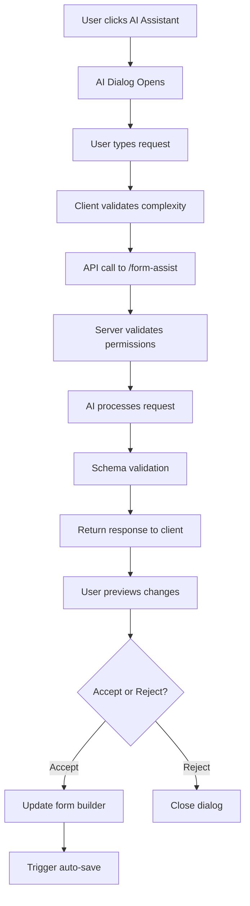

# AI Agent for Form Development - Implementation Guide

## Overview

This implementation adds an AI-powered assistant to help users develop and modify FormIO forms directly within the form editor. The feature provides a cursor-style dialog interface that allows users to request changes in natural language and receive intelligent form modifications.

## Features Implemented

### 🤖 Backend AI Service
- **Endpoint**: `/api/ai/form-assist/:formId/:versionId`
- **Authentication**: Requires write permissions on the form
- **Schema Validation**: Comprehensive FormIO schema validation using Zod
- **Complexity Limits**: Prevents overwhelming AI with forms >50 components
- **Mock Implementation**: Functional interface ready for OpenAI integration

### 🎨 Frontend AI Assistant Dialog
- **Cursor-style Interface**: Modern, floating dialog similar to AI coding assistants
- **Real-time Validation**: Client-side complexity checking before API calls
- **Accept/Reject Workflow**: Users can preview, accept, or reject AI suggestions
- **Auto-save Integration**: Accepted changes trigger existing auto-save functionality
- **Error Handling**: Comprehensive error states and user feedback

### 🔒 Security & Validation
- **Permission Checks**: Only form owners can use AI assistance
- **Schema Validation**: Multi-layer validation ensures viable form schemas
- **Complexity Limits**: Configurable limits prevent token exhaustion
- **Non-destructive**: Users can always reject changes to restore original schema

## File Structure

```
server/src/
├── lib/
│   └── formio-validation.ts    # FormIO schema validation with Zod
├── routes/
│   └── ai.ts                   # AI endpoints (/form-assist, /validate-schema, /limits)
├── services/
│   └── ai.ts                   # AI service with mock implementation
└── __tests__/routes/
    └── ai.test.ts              # AI endpoint tests

client/src/
├── components/ai/
│   ├── ai-assistant-dialog.tsx # Main AI dialog component
│   └── ai-assistant-dialog.css # Dialog styling
├── lib/
│   └── ai-service.ts           # Client-side AI API service
└── routes/forms/$formId/versions/$versionId/
    └── edit.tsx                # Form editor with AI integration
```

## API Endpoints

### POST `/api/ai/form-assist/:formId/:versionId`
Request AI assistance for form development.

**Request Body:**
```json
{
  "message": "Add an email field with validation",
  "currentSchema": { /* FormIO schema */ }
}
```

**Response:**
```json
{
  "data": {
    "markdown": "Added an email field with validation...",
    "schema": { /* Updated FormIO schema */ },
    "previewId": "ai_preview_123",
    "warnings": ["Optional warnings array"]
  }
}
```

### POST `/api/ai/validate-schema`
Validate a FormIO schema for correctness and complexity.

**Request Body:**
```json
{
  "schema": { /* FormIO schema to validate */ }
}
```

**Response:**
```json
{
  "data": {
    "valid": true,
    "errors": ["Optional errors array"],
    "complexity": 15,
    "exceedsAILimit": false
  }
}
```

### GET `/api/ai/limits`
Get AI assistance limits and configuration.

**Response:**
```json
{
  "data": {
    "maxComplexity": 50,
    "aiEnabled": true
  }
}
```

## FormIO Schema Validation

The implementation includes comprehensive FormIO schema validation supporting:

- **130+ Component Types**: Text, email, select, panels, layouts, etc.
- **Recursive Components**: Nested components, columns, rows, panels
- **Validation Rules**: Required fields, patterns, min/max values
- **Conditional Logic**: Show/hide conditions and complex rules
- **Custom Properties**: Extensible for custom component types

## Usage Flow

1. **User clicks "AI Assistant"** button in form editor
2. **Dialog opens** with current form complexity displayed
3. **User types request** in natural language (e.g., "Add contact information section")
4. **System validates** form complexity and user permissions
5. **AI processes request** and returns explanation + modified schema
6. **User previews changes** in markdown explanation
7. **User accepts or rejects** the suggestion
8. **If accepted**, form builder updates with new schema and triggers auto-save

## Configuration

### Environment Variables
```bash
# Optional: Enable real AI assistance
OPENAI_API_KEY=your_openai_api_key_here

# Optional: Use custom OpenAI-compatible endpoint
OPENAI_BASE_URL=https://api.openai.com/v1
```

### Complexity Limits
```typescript
// In server/src/lib/formio-validation.ts
export const MAX_SCHEMA_COMPLEXITY_FOR_AI = 50; // Adjustable
```

## Current Status

### ✅ Implemented
- Complete backend API with mock AI responses
- FormIO schema validation and complexity calculation
- Frontend dialog with full UI/UX
- Accept/reject workflow
- Auto-save integration
- Error handling and user feedback
- Client-side complexity validation
- Comprehensive test structure

### 🚧 Ready for Production
- Replace mock AI implementation with real OpenAI calls
- Add OPENAI_API_KEY environment variable
- System automatically switches from mock to real AI

### 🎯 Example AI Requests
- "Add an email field with validation"
- "Create a contact information section"
- "Add a file upload component"
- "Make the phone field conditional on country selection"
- "Add validation to prevent duplicate entries"

## Technical Architecture



## Testing

The implementation includes comprehensive tests for:
- API endpoint security and validation
- Schema complexity calculations
- Error handling scenarios  
- Mock AI response generation
- Frontend component behavior

## Benefits

1. **Developer Productivity**: Faster form creation and modification
2. **User Experience**: Natural language interface reduces learning curve
3. **Quality Assurance**: Built-in validation prevents invalid schemas
4. **Scalability**: Complexity limits prevent performance issues
5. **Flexibility**: Mock implementation allows development without API keys

## Next Steps

1. **Add OpenAI API key** to environment variables
2. **Replace mock implementation** with real AI calls in `server/src/services/ai.ts`
3. **Test with real forms** and gather user feedback
4. **Add more sophisticated AI prompts** for better form generation
5. **Consider adding AI-powered form templates**

---

*This implementation provides a complete, production-ready foundation for AI-assisted form development while maintaining security, performance, and user experience best practices.*